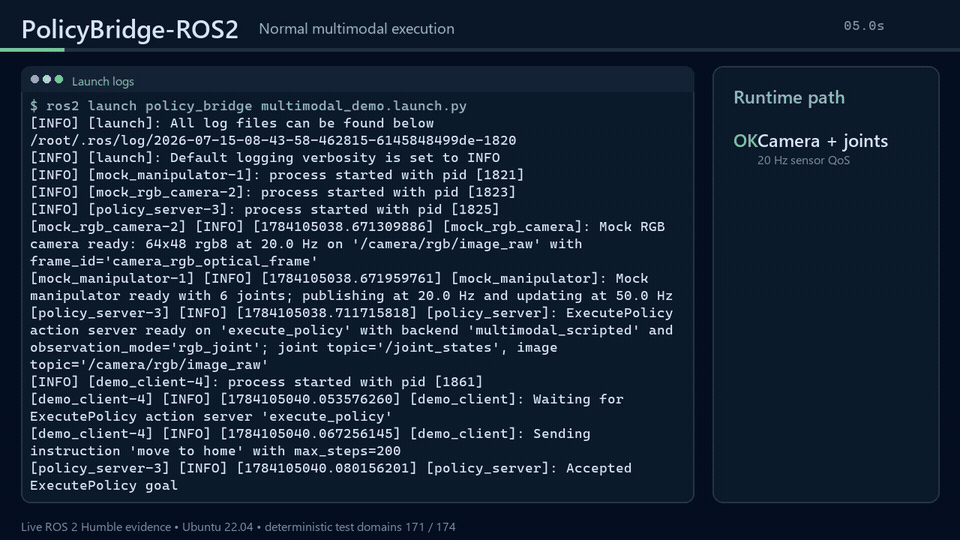
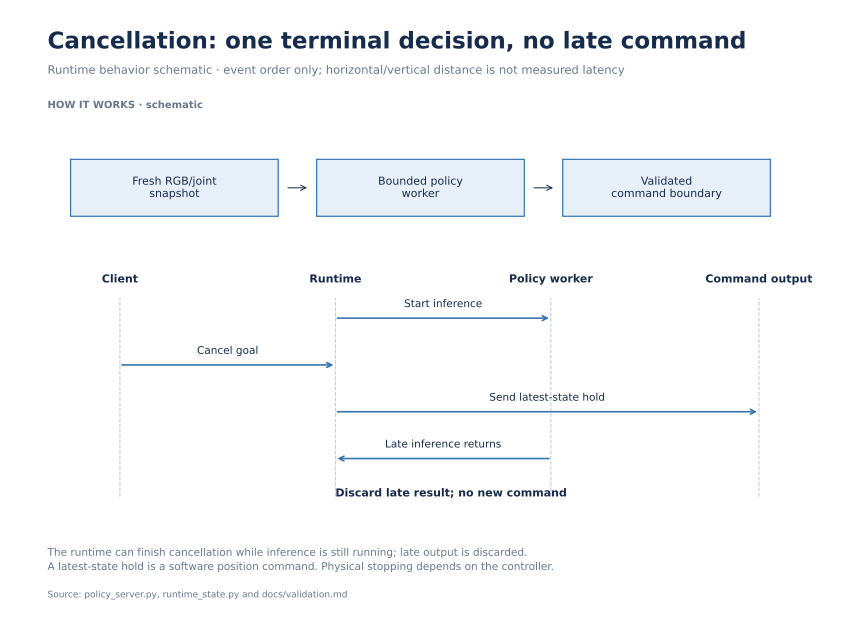
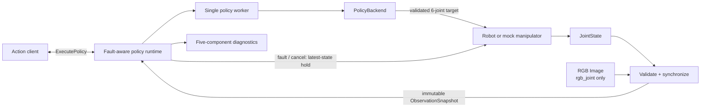

# PolicyBridge-ROS2

**Give robot-policy execution predictable behavior when inference or observations fail.**

Policy inference can finish late, camera data can go stale, and a client can
cancel while a worker is still running. I built a ROS 2 runtime that coordinates
these events through synchronized observations and a single command/termination boundary.

## Results and demo

[](docs/assets/policybridge-ros2-demo.mp4)

- **204 tests passed in the recorded ROS 2 Humble validation**, including
  synchronization, cancellation races, late-result isolation and recovery.
- **4/4 repeated demo runs reached the goal**: two joint-only and two RGB/joint
  runs, with distinct episode IDs and clean shutdown.

Recorded on Ubuntu 22.04.5 / ROS 2 Humble / Python 3.10.12 with scripted policies
and a mock manipulator. [Watch the 75-second demonstration](docs/assets/policybridge-ros2-demo.mp4).

## Visual walkthrough

[](docs/portfolio/overview.png)

This sequence illustrates the implemented cancellation/late-result boundary. It is an explanatory diagram, not a measured timing trace. [Sources and reproduction](docs/portfolio/README.md).

## Engineering challenges

1. **Resolve concurrent terminal events exactly once.** Cancellation, deadlines
   and inference completion can race; late output must not publish a command.
2. **Keep observations fresh and coherent.** RGB and joint streams need bounded
   queues, timestamp checks and immutable snapshots without reusing stale input.

## My contribution

I implemented the ROS 2 Action runtime, policy-worker isolation, first-wins state
transitions, RGB/joint synchronization, action validation and structured diagnostics.
I also built the mock devices, fault-injection backends and integration tests.

## Evidence and reproduction

[Humble validation](docs/validation.md) · [Runtime architecture](docs/architecture.md) ·
[Quick start](#30-second-quick-start) · [Optional physics experiment](docs/PHYSICS_SIMULATION.md).
The physics experiment and supported scope are detailed in the expandable section.

## Runtime architecture



## 30-second quick start

Ubuntu 22.04, ROS 2 Humble, and Python 3.10 are the supported baseline. From a ROS workspace with this repository at `src/PolicyBridge-ROS2`:

```bash
source /opt/ros/humble/setup.bash
rosdep install --from-paths src --ignore-src --rosdistro humble -r -y
colcon build --symlink-install
source install/setup.bash
ros2 launch policy_bridge demo.launch.py
```

The default demo is camera-free. To run the synchronized RGB + joint path instead:

```bash
ros2 launch policy_bridge multimodal_demo.launch.py
```

Both demos submit `move to home` and normally finish with `success=true` and `termination_reason=goal_reached`.

## Normal demo

`demo.launch.py` starts the six-joint mock manipulator, policy server, and one-shot client in the default `joint_only` mode.

The GIF shows the normal synchronized RGB + joint path. Select it to open the full 75-second demonstration, which also covers diagnostics, `stale_image`, cancellation, deterministic hold, validation, and the three versioned milestones.

The multimodal launch additionally starts a deterministic 64×48 `rgb8` mock camera and selects `multimodal_scripted`. That backend verifies RGB reached `predict()` and returns the fixed home target; it is a transport demonstration, not a learned vision model.

## Fault-aware behavior

The runtime admits one active Goal, runs at most one synchronous policy call, and lets only the first terminal decision win. Late worker output or a losing race cannot publish a command or replace the result.

| Termination reason | Action state | Runtime behavior |
| --- | --- | --- |
| `goal_reached` | `SUCCEEDED` | No hold requested |
| `max_steps_exceeded` | `ABORTED` | Hold after motion started |
| `unsupported_instruction` | `ABORTED` | Hold only if motion already started |
| `goal_canceled` | `CANCELED` | One hold requested |
| `goal_timeout` | `ABORTED` | One hold requested |
| `policy_inference_timeout` | `ABORTED` | Hold; late result ignored |
| `observation_timeout` | `ABORTED` | Hold if a valid joint state exists |
| `stale_observation` | `ABORTED` | Hold latest valid joint state |
| `image_timeout` | `ABORTED` | No valid image arrived in time; hold requested |
| `stale_image` | `ABORTED` | Image stopped updating; hold requested |
| `invalid_image` | `ABORTED` | Images remained invalid; hold requested |
| `observation_sync_timeout` | `ABORTED` | Fresh streams did not form a new pair; hold requested |
| `invalid_action` | `ABORTED` | Invalid policy output rejected; hold requested |
| `policy_error` | `ABORTED` | Backend exception contained; hold requested |

A hold copies and revalidates the latest valid six-joint state under the same command gate as normal publication. If no valid state exists, the runtime reports `safe_stop_unavailable_no_valid_state` and never fabricates a zero target.

> A hold is a software-level absolute-position target. It is not a braking controller, physical-stop acknowledgment, hardware interlock, or safety-certified emergency stop.

## Observation contract

### Two explicit modes

| Mode | Required inputs | Policy snapshot | Default/demo backend |
| --- | --- | --- | --- |
| `joint_only` (default) | `/joint_states` | Six joints and `rgb=None` | `scripted` |
| `rgb_joint` | Header-stamped `/joint_states` + `/camera/rgb/image_raw` | One synchronized joint/RGB pair | `multimodal_scripted` demo |

`rgb_joint` never silently falls back to joint-only behavior. The node rejects `multimodal_scripted` with `joint_only` during startup.

Every backend receives the same ROS-independent value:

```python
@dataclass(frozen=True, slots=True)
class ObservationSnapshot:
    sequence_id: int
    joint_positions: NDArray[np.float64]       # shape (6,)
    joint_names: tuple[str, ...]
    rgb: NDArray[np.uint8] | None              # H x W x 3, RGB order
    joint_stamp_ns: int
    image_stamp_ns: int | None
    received_monotonic_ns: int
    synchronization_skew_ms: float | None
    image_frame_id: str | None
```

Construction validates all fields, copies joint/RGB arrays into owned storage, and marks both copies read-only. ROS messages never cross into a backend. There is one policy signature:

```python
def predict(
    observation: ObservationSnapshot,
    instruction: str,
) -> np.ndarray:
    ...
```

Accepted `sequence_id` values strictly increase. After a normal command, the next inference waits for `sequence_id > previous_sequence_id`. Goal-local and wait-local epochs prevent messages or errors from an earlier Goal/wait from triggering a new `invalid_image` or synchronization timeout.

### RGB validation

The runtime formally supports raw `sensor_msgs/msg/Image` encodings:

- `rgb8`
- `bgr8`, converted to RGB

The result must be an owned, contiguous `(height, width, 3)` `uint8` RGB array. Validation handles row padding and rejects unsupported encodings, zero dimensions, undersized `step`, truncated buffers, empty frames, and images above `max_image_pixels` before an unbounded output allocation. The common runtime performs no resize, crop, normalization, augmentation, model preprocessing, or GPU conversion.

### Synchronization, clocks, and QoS

- Source `header.stamp` values select joint/image pairs and calculate skew.
- Local `time.monotonic()` receipt time governs Goal, joint, image, and snapshot freshness.
- Positive `sync_slop_seconds` uses bounded `ApproximateTimeSynchronizer` with `allow_headerless=False`.
- Zero slop uses `TimeSynchronizer` for exact header matching.
- Missing/zero RGB-mode stamps are rejected; current time is never substituted.

| Topic | Type | QoS / role |
| --- | --- | --- |
| `/joint_states` | `sensor_msgs/msg/JointState` | Explicit keep-last, best-effort, volatile sensor QoS |
| `/camera/rgb/image_raw` | `sensor_msgs/msg/Image` | Same sensor QoS; `rgb_joint` only |
| `/joint_command` | `std_msgs/msg/Float64MultiArray` | Six finite absolute positions, normal or hold |
| `/policy_bridge/diagnostics` | `diagnostic_msgs/msg/DiagnosticArray` | Bounded metadata-only status snapshots |

Joint/image subscriber depth is `sync_queue_size`. Topic names are parameters and remain remappable; images are not transient-local cached.

## ROS action and diagnostics

M2 does not change `policy_bridge_interfaces/action/ExecutePolicy.action`:

```text
# Goal
string instruction
int32 max_steps
float32 timeout_seconds
---
# Result
bool success
string termination_reason
string episode_id
---
# Feedback
int32 current_step
float32 progress
float32 inference_latency_ms
```

Every `/policy_bridge/diagnostics` message contains:

| Status | Key information |
| --- | --- |
| `policy_bridge/runtime` | State, active Goal, episode, last termination, elapsed time, hold count/status |
| `policy_bridge/observation` | Joint receipt, validity, age, timeout |
| `policy_bridge/policy` | Backend, busy state, inference latency/timeout, last error |
| `policy_bridge/image` | Required/received/valid, age/timeout, encoding, dimensions, frame, last error |
| `policy_bridge/synchronization` | Snapshot availability/sequence/age, skew/slop, queue size, timeout, last error |

Image and synchronization statuses are `OK / disabled` in `joint_only`. In RGB mode, healthy state is `OK`, waiting/near-deadline state is `WARN`, and a winning image/sync fault is `ERROR`. Current health can recover while `last_*_error` retains bounded historical context. No pixels or arrays are logged.

```bash
ros2 topic echo /policy_bridge/diagnostics
```

## Configuration

Joint-only defaults live in `policy_bridge/config/demo.yaml`; multimodal defaults live in `policy_bridge/config/multimodal_demo.yaml`.

| Policy-server parameter | Default | Contract |
| --- | ---: | --- |
| `observation_mode` | `joint_only` | `joint_only` or `rgb_joint` |
| `policy_backend` | `scripted` | Static built-in allow-list |
| `image_topic` | `/camera/rgb/image_raw` | Required and non-empty in RGB mode |
| `inference_timeout_seconds` | `1.0` | Positive finite per-call limit |
| `joint_state_timeout_seconds` | `1.0` | Positive finite joint freshness limit |
| `image_timeout_seconds` | `1.0` | Positive finite image limit |
| `synchronized_observation_timeout_seconds` | `1.0` | Positive finite new-pair wait |
| `sync_queue_size` | `10` | Integer from 2 through 100 |
| `sync_slop_seconds` | `0.05` | 0 through 1 second; zero means exact sync |
| `max_image_pixels` | `2073600` | 1920×1080 default; hard ceiling 4096×4096 |

Built-in selectors are `scripted`, `multimodal_scripted`, `delayed`, `invalid_wrong_shape`, `invalid_nan`, `invalid_inf`, and `raising`. Only `scripted` is the production default; the remaining selectors are bounded demonstrations or fault-injection tools.

## Validation

Final release evidence was collected in Ubuntu 22.04.5 / ROS 2 Humble / Python 3.10.12:

| Check | Result |
| --- | --- |
| Clean dependency resolution and build | 2 packages built from empty `build/install/log` in 4.26 s |
| Isolated Humble `colcon test` | **204 passed**, 0 errors, 0 failures, 0 skipped |
| Independent Humble `pytest` | **204 passed** |
| Windows non-ROS suite | 201 passed, 3 ROS-only modules skipped |
| Joint-only demo | 2/2 `goal_reached`, distinct episode IDs, clean shutdown |
| Multimodal demo | 2/2 `goal_reached`, RGB delivered, distinct episode IDs, clean shutdown |

The Humble integration suite exercises exact and approximate synchronization, all four RGB/synchronization fault reasons, sequence gating, waiting cancellation, three first-wins races, one-shot latest-state holds, diagnostics, and recovery. A live multimodal sample reported `rgb8` 64×48, snapshot sequence 320, and 1.315 ms skew under a 50 ms slop.

Run the same package suite with:

```bash
colcon test --packages-select policy_bridge policy_bridge_interfaces \
  --event-handlers console_direct+
colcon test-result --verbose
python3 -m pytest -q
```

See [docs/validation.md](docs/validation.md) for the exact commands, isolation note, failure-path evidence, diagnostics sample, and repeated-demo episode IDs. See [docs/architecture.md](docs/architecture.md) for synchronization, epoch, memory, and concurrency details.

<details>
<summary>Evaluation details, tradeoffs and supported scope</summary>

## Physics integration example

An optional [headless PyBullet example](docs/PHYSICS_SIMULATION.md) connects the
existing observation/policy/action boundary to a six-joint rigid-body chain.
It requires neither ROS nor a graphical window and records reproducible trajectories.

The retained eight starting configurations passed 8/8 home-convergence checks
and 7/8 hold-transient checks. The overall physics gate is **not passed**: one
hold transient exceeded 0.05 rad, even though its final position settled. This
illustrates why a position hold is not an instantaneous physical stop.

This is a scripted-policy physics example, not learned-policy deployment or a
new ROS Action integration result. See the [complete results and reproduction commands](docs/PHYSICS_SIMULATION.md).

## Limits and Future Integration

- One active Goal, one six-joint absolute-position command mode, one raw RGB camera, and one synchronous Python worker are supported.
- RGB is limited to uncompressed `rgb8`/`bgr8`; there is no depth, multi-camera fusion, `CameraInfo`, calibration, TF, point cloud, or GPU preprocessing.
- Python cannot forcibly terminate arbitrary backend code already running in a thread. The Action can terminate and ignore a late result, but a backend that never returns can keep the worker busy and delay process exit.
- There is no hard-real-time guarantee, trajectory planning, collision checking, controller acknowledgment, hardware driver, automatic recovery/replanning, remote inference, dashboard/database, multi-robot orchestration, or safety certification.
- The included `scripted` and `multimodal_scripted` backends are deterministic demos, not neural networks or VLM/VLA models.

The `PolicyBackend` boundary is the honest extension point for a learned policy. LangMani and LatentGuard are not currently integrated; future adapters can implement `predict(ObservationSnapshot, instruction)` without changing the ROS action or observation pipeline. The project does not currently claim model loading, dynamic plugin discovery, OpenAI/Hugging Face APIs, ONNX, TensorRT, CUDA, or remote inference.

</details>

## License

Licensed under the Apache License 2.0. See [LICENSE](LICENSE).
