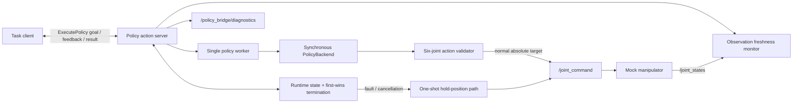

# PolicyBridge-ROS2

PolicyBridge-ROS2 is a lightweight ROS 2 runtime for exposing synchronous Python robot policies through a standard task-level action interface. Version `0.2.0` (M1) adds runtime fault handling, bounded policy execution, observation-freshness checks, deterministic hold-position commands, and structured diagnostics while keeping the public `ExecutePolicy` action unchanged.

> **M1 scope:** the repository implements a deterministic six-joint mock runtime and its fault paths. Its hold-position command is a software-level absolute-position target, not a safety-certified emergency stop or proof that physical motion has stopped.

## What it provides

The runtime separates task requests, policy inference, command validation, and robot-facing ROS I/O:

- `ExecutePolicy` accepts one task goal and reports feedback plus one terminal result.
- A ROS-independent `PolicyBackend` keeps synchronous Python policy code outside the ROS node contract.
- A single bounded worker runs `PolicyBackend.predict()` without blocking cancellation, deadline, or freshness checks.
- A thread-safe runtime state machine admits at most one Goal and gives competing success, timeout, fault, and cancellation paths one first-wins terminal decision.
- Six-joint observations and policy actions are validated before use.
- Selected terminal paths publish the most recent valid joint state as an absolute hold-position target.
- `/policy_bridge/diagnostics` exposes runtime, observation, and policy status.

The production default remains `ScriptedPolicy`, which supports the exact instruction `move to home`. Unknown instructions and malformed actions fail explicitly; there is no random fallback.

## Architecture



The policy, validation, dynamics, and runtime-state logic are separate from ROS node classes so they can be unit-tested directly. See [docs/architecture.md](docs/architecture.md) for component and concurrency contracts.

## Requirements

The supported target environment is:

- Ubuntu 22.04
- ROS 2 Humble
- the system Python 3.10 interpreter supplied with Ubuntu 22.04 / ROS 2 Humble
- `colcon` with the ROS 2 `ament_cmake` and `ament_python` build types
- NumPy and pytest, normally resolved through `rosdep` / Ubuntu packages

The demo does not require a GPU, camera, simulator, motion planner, or physical robot.

## Build

Create a ROS 2 workspace and clone the repository under its `src` directory:

```bash
mkdir -p ~/policybridge_ws/src
cd ~/policybridge_ws/src
git clone <repository-url> PolicyBridge-ROS2
cd ~/policybridge_ws

source /opt/ros/humble/setup.bash
rosdep install --from-paths src --ignore-src --rosdistro humble -r -y
colcon build --symlink-install
source install/setup.bash
```

Replace `<repository-url>` with the actual repository URL. Source `/opt/ros/humble/setup.bash` in each new shell before building, and source the workspace's `install/setup.bash` before using its packages.

## Run the normal demo

After building and sourcing the workspace:

```bash
ros2 launch policy_bridge demo.launch.py
```

The launch file starts the mock manipulator, policy server, and a one-shot demo client. A successful result has `success=true` and `termination_reason=goal_reached`; timestamps, feedback samples, and UUID-derived episode IDs vary.

For manual Goal and fault-path exercises, run the mock and server in separate sourced shells:

```bash
# Shell 1
CONFIG="$(ros2 pkg prefix policy_bridge)/share/policy_bridge/config/demo.yaml"
ros2 run policy_bridge mock_manipulator --ros-args --params-file "$CONFIG"
```

```bash
# Shell 2
CONFIG="$(ros2 pkg prefix policy_bridge)/share/policy_bridge/config/demo.yaml"
ros2 run policy_bridge policy_server --ros-args --params-file "$CONFIG"
```

Then send a normal Goal from a third sourced shell:

```bash
ros2 action send_goal /execute_policy \
  policy_bridge_interfaces/action/ExecutePolicy \
  "{instruction: 'move to home', max_steps: 200, timeout_seconds: 0.0}" \
  --feedback
```

### Goal timeout

For a repeatable timeout exercise, restart the mock with slow motion:

```bash
ros2 run policy_bridge mock_manipulator --ros-args \
  --params-file "$CONFIG" -p max_delta_per_step:=0.0001
```

Then use a short whole-Goal deadline:

```bash
ros2 action send_goal /execute_policy \
  policy_bridge_interfaces/action/ExecutePolicy \
  "{instruction: 'move to home', max_steps: 2000, timeout_seconds: 0.2}" \
  --feedback
```

The expected terminal result is `ABORTED`, `success=false`, and `termination_reason=goal_timeout`. If a valid joint state exists, the last command for that termination is its hold-position target.

### Cancellation

With the slow mock running, send a deadline-free Goal and press `Ctrl+C` after the Goal is accepted or after its first feedback:

```bash
ros2 action send_goal /execute_policy \
  policy_bridge_interfaces/action/ExecutePolicy \
  "{instruction: 'move to home', max_steps: 2000, timeout_seconds: 0.0}" \
  --feedback
```

An accepted cancellation returns `CANCELED / goal_canceled` and requests one hold-position publication. No later policy result from that Goal may publish a normal command.

### Invalid policy action

The non-default backends are deterministic fault-injection tools. Stop the policy server, restart it with an invalid-action backend, and send the normal Goal again:

```bash
ros2 run policy_bridge policy_server --ros-args \
  --params-file "$CONFIG" -p policy_backend:=invalid_nan
```

The Goal returns `ABORTED / invalid_action`; the server remains alive. `invalid_wrong_shape` and `invalid_inf` exercise the other validation failures. These selectors are test backends, not model integrations.

## Goal timeout semantics

`timeout_seconds` belongs to each `ExecutePolicy` Goal:

- `timeout_seconds > 0` enables one whole-Goal deadline measured from execution start with `time.monotonic()`.
- `timeout_seconds == 0` disables the wall-clock deadline; `max_steps`, inference timeout, observation freshness, cancellation, and other guards still apply.
- Negative or non-finite timeout values are rejected before execution.
- `max_steps <= 0` is also rejected.

The server checks the deadline while waiting for the first observation, before and while waiting for inference, before command publication, while waiting for observation updates, and before success. Inference waits are bounded by the earliest applicable Goal, inference, or observation deadline. A locked first-wins decision prevents one Goal from reporting both success and a competing timeout or cancellation.

## Policy worker and late results

`PolicyBackend.predict()` deliberately remains synchronous. The server submits it to one `ThreadPoolExecutor(max_workers=1)` and polls with short bounded waits so cancellation, Goal timeout, stale observations, and ROS shutdown remain observable.

Python cannot reliably force-stop arbitrary code already running in a thread. Consequently:

- an inference timeout immediately ends the Goal as `ABORTED / policy_inference_timeout` and requests hold;
- the running call remains marked `backend_busy` until it actually returns or raises;
- new Goals are rejected while that call is still busy;
- a late return value is discarded and can never publish a command;
- the executor has one worker, so repeated timeouts do not create an unbounded thread pool.

The included `delayed`, invalid-action, and raising test backends all return or raise after finite, deterministic work; `scripted` remains the production default. A custom synchronous backend that never returns cannot be forcibly killed and may also delay full Python-process exit. Process isolation for untrusted or unbounded model code is outside M1.

## Observation freshness

Freshness is measured from local receipt time with `time.monotonic()`, not from the message header stamp. A valid observation contains exactly six finite numeric positions. If names are present, they must be unique and include all configured joint names; if names are omitted, positions are interpreted in configured order.

- If the runtime has no valid state and none arrives within `joint_state_timeout_seconds`, the Goal ends with `observation_timeout`.
- A previously valid state older than that threshold during an active Goal produces `stale_observation`.
- Invalid messages do not refresh the last-valid timestamp.

Both faults request the centralized hold path. If no valid state exists, the runtime does not invent a zero position; diagnostics report `safe_stop_unavailable_no_valid_state` instead.

## Deterministic hold-position behavior

For a hold-authorized terminal decision, the server acquires the same command gate used by normal publication, copies the latest valid six-joint state, validates it again, and publishes it once as a `std_msgs/msg/Float64MultiArray` absolute target on `/joint_command`. The winning terminal decision owns at most one hold attempt, and no normal policy command is published after that decision.

Hold is requested for cancellation, Goal timeout, inference timeout, stale observation, invalid action, policy exception, and `max_steps_exceeded` after motion has started. Unsupported instructions before motion and pre-execution Goal rejection do not require a hold. A missing valid observation is diagnosed rather than replaced with a fabricated target.

This is deterministic software behavior only. It does not provide trajectory braking, velocity or torque control, command acknowledgment, controller-level latching, hardware interlocks, collision avoidance, or an industrial emergency-stop guarantee.

## Diagnostics

The server publishes `diagnostic_msgs/msg/DiagnosticArray` on:

```text
/policy_bridge/diagnostics
```

Snapshots are published at `diagnostics_rate_hz` and immediately on important state changes. Inspect them with:

```bash
ros2 topic echo /policy_bridge/diagnostics
```

Each array contains these three `DiagnosticStatus` entries:

| Status name | Keys | Level behavior |
| --- | --- | --- |
| `policy_bridge/runtime` | `runtime_state`, `active_goal`, `episode_id`, `last_termination_reason`, `goal_elapsed_ms`, `safe_stop_count`, `safe_stop_status`, `last_safe_stop_reason` | `OK` for normal admission/success, `WARN` for cancellation, `ERROR` for an aborted fault |
| `policy_bridge/observation` | `joint_state_received`, `joint_state_valid`, `joint_state_age_ms`, `joint_state_timeout_ms` | `WARN` while waiting or near the freshness deadline; `ERROR` for observation timeout/staleness; otherwise `OK` |
| `policy_bridge/policy` | `backend_name`, `backend_busy`, `last_inference_latency_ms`, `inference_timeout_ms`, `last_policy_error` | `WARN` while the worker is busy; `ERROR` for inference timeout, invalid action, or policy error; otherwise `OK` |

`safe_stop_count` counts successfully published hold commands. `safe_stop_status` distinguishes `published`, `not_requested`, and an unavailable/failure reason; its name does not imply safety certification.

## Termination and admission outcomes

| Reason | ROS Action state | `success` | Hold behavior |
| --- | --- | --- | --- |
| `goal_reached` | `SUCCEEDED` | `true` | Not requested |
| `max_steps_exceeded` | `ABORTED` | `false` | Requested only if motion started |
| `unsupported_instruction` | `ABORTED` | `false` | Requested only if motion started |
| `goal_canceled` | `CANCELED` | `false` | Requested |
| `goal_timeout` | `ABORTED` | `false` | Requested |
| `policy_inference_timeout` | `ABORTED` | `false` | Requested; late result ignored |
| `observation_timeout` | `ABORTED` | `false` | Requested, but unavailable without a valid state |
| `stale_observation` | `ABORTED` | `false` | Requested from the last valid state |
| `invalid_action` | `ABORTED` | `false` | Requested |
| `policy_error` | `ABORTED` | `false` | Requested |

Invalid Goal fields, a concurrent active Goal, and a Goal submitted while `backend_busy` are rejected during admission and therefore do not produce a result with a termination reason. `server_shutting_down` and `runtime_state_error` are internal shutdown/invariant fallback reasons, not normal task outcomes.

## Parameters

The installed defaults are in `policy_bridge/config/demo.yaml`.

| Policy-server parameter | Default | Contract |
| --- | ---: | --- |
| `action_name` | `execute_policy` | Non-empty Action name |
| `joint_state_topic` | `/joint_states` | Non-empty observation topic |
| `joint_command_topic` | `/joint_command` | Non-empty absolute-position command topic |
| `policy_backend` | `scripted` | `scripted`, `delayed`, `invalid_wrong_shape`, `invalid_nan`, `invalid_inf`, or `raising` |
| `inference_timeout_seconds` | `1.0` | Finite and greater than zero; per-call timeout |
| `joint_state_timeout_seconds` | `1.0` | Finite and greater than zero; first-state and freshness limit |
| `diagnostics_rate_hz` | `1.0` | Finite and greater than zero |
| `delayed_policy_delay_seconds` | `2.0` | Finite, non-negative test-backend delay |
| `delayed_policy_first_call_only` | `true` | Delay only the first prediction after each reset |
| `control_rate_hz` | `10.0` | Finite and greater than zero |
| `goal_tolerance` | `0.005` | Finite and non-negative maximum joint error |
| `joint_names` | `joint_1` ... `joint_6` | Exactly six unique, non-empty names |

The demo client defaults to `instruction: move to home`, `max_steps: 200`, and `timeout_seconds: 0.0`. Tests and fault exercises should pass their parameters explicitly rather than rely on hidden defaults.

## Tests

Run ROS-independent tests from the repository root:

```bash
python3 -m pytest policy_bridge/test
```

In a sourced ROS 2 Humble workspace, run the complete package and launch/integration suite with:

```bash
colcon test --packages-select policy_bridge policy_bridge_interfaces \
  --event-handlers console_direct+
colcon test-result --verbose
```

Current environment-specific commands and results are recorded in [docs/validation.md](docs/validation.md); this README intentionally does not duplicate a potentially stale test count.

## Current limitations and M2 boundary

- The runtime supports one six-joint absolute-position action mode, one active Goal, and one synchronous policy worker.
- `ScriptedPolicy` supports only `move to home`; the other built-in backends exist for deterministic fault testing.
- Hold-position is neither a physical stop acknowledgment nor a safety-certified control function.
- Arbitrary Python already running in the worker thread cannot be forcibly terminated.
- The runtime has no hard real-time guarantee and no automatic recovery or replanning; after a handled fault, a client must submit a fresh Goal.
- M1 does not implement LangMani or LatentGuard adapters, learned/neural-network models, dynamic plugin discovery, model downloads, lifecycle nodes, RGB/depth/camera pipelines, `message_filters`, TF, MoveIt or MoveIt Servo, Gazebo, Isaac Sim, ManiSkill, Unity, rosbag2, remote inference, gRPC, ONNX, TensorRT, dashboards, databases, telemetry services, multi-robot coordination, controller safety certification, or a real industrial emergency-stop interface.

Those integrations belong to later milestones. M1 does not include or partially scaffold M2 functionality.

## License

Licensed under the Apache License 2.0. See [LICENSE](LICENSE).
