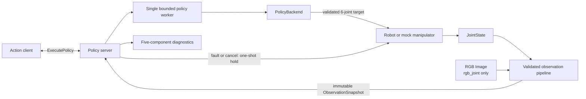

# PolicyBridge-ROS2

PolicyBridge-ROS2 is a lightweight ROS 2 Humble runtime for exposing synchronous Python robot policies through a stable task-level action interface. Release `0.3.0` (M2) delivers three concrete capabilities:

- **ROS 2 policy execution** through the unchanged `ExecutePolicy` action.
- **Deterministic runtime fault handling** with bounded inference, first-wins termination, and one-shot hold-position commands.
- **Synchronized RGB + joint observations** through an immutable, ROS-independent policy input.

> **Safety boundary:** a hold is a software-level absolute-position target equal to the latest valid joint state. It is not a braking controller, command acknowledgment, physical-stop proof, hardware interlock, or safety-certified emergency stop.

## How the runtime fits together



The normal loop is observation → policy inference → validated command → new observation. After a normal command, another inference cannot run until a snapshot with a strictly greater `sequence_id` arrives. Deadline, cancellation, joint freshness, image freshness, and synchronization checks stay active while the loop waits.

## Observation modes

`observation_mode` selects one of two startup-validated modes:

| Mode | Inputs | Snapshot | Intended backend |
| --- | --- | --- | --- |
| `joint_only` (default) | `/joint_states` | Six joints, `rgb=None` | `scripted` and M1-compatible backends |
| `rgb_joint` | Header-stamped `/joint_states` plus `/camera/rgb/image_raw` | One synchronized joint/RGB pair | `multimodal_scripted` demo backend or a compatible custom backend |

`rgb_joint` never silently falls back to joint-only behavior. `multimodal_scripted` is rejected with `joint_only`, and missing, invalid, stale, or persistently unsynchronized images terminate the active Goal with a specific reason.

The runtime accepts only `sensor_msgs/msg/Image` encodings `rgb8` and `bgr8`. Both become owned, C-contiguous `uint8` arrays in RGB channel order with shape `(height, width, 3)`. Row padding is handled; unsupported encodings, inconsistent dimensions or `step`, truncated data, empty images, and images above `max_image_pixels` are rejected. The common runtime does not resize, crop, normalize, augment, or convert images to GPU tensors.

## Build

The supported target is Ubuntu 22.04 with ROS 2 Humble and its system Python 3.10:

```bash
mkdir -p ~/policybridge_ws/src
cd ~/policybridge_ws/src
git clone <repository-url> PolicyBridge-ROS2
cd ~/policybridge_ws

source /opt/ros/humble/setup.bash
rosdep install --from-paths src --ignore-src --rosdistro humble -r -y
colcon build --symlink-install
source install/setup.bash
```

Replace `<repository-url>` with the repository URL. Source ROS and the workspace again in each new shell.

## Run the demos

The joint-only demo starts the mock manipulator, policy server, and one-shot client. It does not start or require a camera:

```bash
ros2 launch policy_bridge demo.launch.py
```

The multimodal demo additionally starts the deterministic 64×48 mock RGB camera and runs `multimodal_scripted`:

```bash
ros2 launch policy_bridge multimodal_demo.launch.py
```

Both clients submit `move to home`. A normal completion reports `success=true` and `termination_reason=goal_reached`; episode IDs and feedback timestamps vary. The multimodal test backend checks that a bounded RGB array actually reached `predict()` and then returns the same fixed six-joint home target—it is not a learned vision model.

## Test status and commands

The complete, environment-specific evidence belongs in [docs/validation.md](docs/validation.md). The final isolated ROS 2 Humble run collected 204 tests and passed all 204 with 0 errors, 0 failures, and 0 skipped; an independent Humble `pytest` run also passed all 204. Both joint-only and multimodal demos then succeeded twice with distinct episode IDs and clean shutdown.

Run the full suite in a sourced workspace:

```bash
colcon test --packages-select policy_bridge policy_bridge_interfaces \
  --event-handlers console_direct+
colcon test-result --verbose

cd ~/policybridge_ws/src/PolicyBridge-ROS2
python3 -m pytest -q
```

## ROS interfaces and QoS

`policy_bridge_interfaces/action/ExecutePolicy.action` remains unchanged:

```text
# Goal
string instruction
int32 max_steps
float32 timeout_seconds
---
# Result
bool success
string termination_reason
string episode_id
---
# Feedback
int32 current_step
float32 progress
float32 inference_latency_ms
```

| Topic | Type | Role | QoS |
| --- | --- | --- | --- |
| `/joint_states` | `sensor_msgs/msg/JointState` | Six-joint observation | Explicit sensor-data: keep-last, best-effort, volatile; subscriber depth is `sync_queue_size` |
| `/camera/rgb/image_raw` | `sensor_msgs/msg/Image` | RGB input in `rgb_joint` | Explicit sensor-data: keep-last, best-effort, volatile; subscriber depth is `sync_queue_size` |
| `/joint_command` | `std_msgs/msg/Float64MultiArray` | Normal or hold absolute-position target | Bounded default ROS publisher/subscriber queues |
| `/policy_bridge/diagnostics` | `diagnostic_msgs/msg/DiagnosticArray` | Runtime health snapshots | Bounded default ROS publisher queue |

`joint_state_topic`, `image_topic`, and `joint_command_topic` are parameters and can also be remapped. The mock manipulator and camera use ROS 2's explicit sensor-data QoS profile, compatible with the runtime subscribers. Images are volatile; no transient-local frame cache is used.

## Header synchronization and local freshness

The two time domains have separate jobs:

- `JointState.header.stamp` and `Image.header.stamp` select synchronized pairs and calculate `synchronization_skew_ms`.
- Local `time.monotonic()` receipt times enforce Goal, joint, image, and synchronized-observation freshness even if ROS time or a device clock changes.

In `rgb_joint`, validated messages enter `message_filters.ApproximateTimeSynchronizer` with finite `sync_queue_size`, `sync_slop_seconds`, and `allow_headerless=False`. A zero slop selects `message_filters.TimeSynchronizer` for exact header-stamp matching because Humble's approximate synchronizer does not match at zero slop. A missing or zero header stamp is rejected; the runtime never substitutes the current time. The default parameters are a queue of 10 and a 0.05-second slop.

## ObservationSnapshot and backend boundary

Every backend receives exactly one ROS-independent value:

```python
@dataclass(frozen=True, slots=True)
class ObservationSnapshot:
    sequence_id: int
    joint_positions: NDArray[np.float64]       # shape (6,)
    joint_names: tuple[str, ...]
    rgb: NDArray[np.uint8] | None              # H x W x 3, RGB order
    joint_stamp_ns: int
    image_stamp_ns: int | None
    received_monotonic_ns: int
    synchronization_skew_ms: float | None
    image_frame_id: str | None
```

Construction validates every field, copies joint and RGB arrays into owned storage, and marks the copies read-only. Callers cannot replace dataclass fields. `rgb`, `image_stamp_ns`, skew, and frame ID are all `None` in `joint_only`; they are required and internally consistent in an RGB snapshot. Accepted sequence IDs are positive and strictly increase in the runtime.

The one supported policy signature is:

```python
def predict(
    observation: ObservationSnapshot,
    instruction: str,
) -> np.ndarray:
    ...
```

ROS messages stop at the runtime callback boundary and are never passed to a backend. See [docs/architecture.md](docs/architecture.md) for the complete memory, synchronization, and concurrency contracts.

## Fault handling and termination outcomes

The runtime admits one active Goal, runs at most one synchronous policy call, and lets only the first terminal decision win. A late worker result or losing race cannot publish a normal command or replace the result. Hold-authorized paths copy and revalidate the latest valid six-joint state under the same command gate as normal publications.

| Reason | Action state | Hold behavior |
| --- | --- | --- |
| `goal_reached` | `SUCCEEDED` | Not requested |
| `max_steps_exceeded` | `ABORTED` | Requested only after motion started |
| `unsupported_instruction` | `ABORTED` | Requested only after motion started |
| `goal_canceled` | `CANCELED` | Requested |
| `goal_timeout` | `ABORTED` | Requested |
| `policy_inference_timeout` | `ABORTED` | Requested; late result ignored |
| `observation_timeout` | `ABORTED` | Requested, but unavailable without a valid joint state |
| `stale_observation` | `ABORTED` | Requested from the latest valid joint state |
| `image_timeout` | `ABORTED` | Requested; no valid image arrived in time |
| `stale_image` | `ABORTED` | Requested; a previously valid image stopped updating |
| `invalid_image` | `ABORTED` | Requested; received images remained invalid through the wait limit |
| `observation_sync_timeout` | `ABORTED` | Requested; fresh valid streams did not yield a newer synchronized pair |
| `invalid_action` | `ABORTED` | Requested |
| `policy_error` | `ABORTED` | Requested |

If no valid joint state exists, the server never invents a zero-vector hold and reports `safe_stop_unavailable_no_valid_state`. Goal-field errors, a concurrent active Goal, and a Goal submitted while `backend_busy` are admission rejections rather than result reasons.

## Diagnostics

Every `/policy_bridge/diagnostics` array contains the original three components plus two M2 components:

| Status name | Keys |
| --- | --- |
| `policy_bridge/runtime` | `runtime_state`, `active_goal`, `episode_id`, `last_termination_reason`, `goal_elapsed_ms`, `safe_stop_count`, `safe_stop_status`, `last_safe_stop_reason` |
| `policy_bridge/observation` | `joint_state_received`, `joint_state_valid`, `joint_state_age_ms`, `joint_state_timeout_ms` |
| `policy_bridge/policy` | `backend_name`, `backend_busy`, `last_inference_latency_ms`, `inference_timeout_ms`, `last_policy_error` |
| `policy_bridge/image` | `image_required`, `image_received`, `image_valid`, `image_age_ms`, `image_timeout_ms`, `encoding`, `width`, `height`, `frame_id`, `last_image_error` |
| `policy_bridge/synchronization` | `synchronized_snapshot_available`, `snapshot_sequence_id`, `snapshot_age_ms`, `last_sync_skew_ms`, `sync_slop_ms`, `sync_queue_size`, `synchronized_observation_timeout_ms`, `last_sync_error` |

Image and synchronization statuses are `OK / disabled` in `joint_only`. In `rgb_joint`, normal synchronization is `OK`, waiting or nearing a deadline is `WARN`, and a winning image/synchronization fault is `ERROR`. After finalization, current health may return to idle/OK while the runtime retains `last_termination_reason` and image/synchronization statuses retain their last error metadata. No diagnostic contains image pixels or an array dump.

Inspect the topic with:

```bash
ros2 topic echo /policy_bridge/diagnostics
```

## Parameters

Installed defaults are in `policy_bridge/config/demo.yaml`; multimodal overrides are in `policy_bridge/config/multimodal_demo.yaml`.

| Policy-server parameter | Default | Contract |
| --- | ---: | --- |
| `observation_mode` | `joint_only` | Exactly `joint_only` or `rgb_joint` |
| `policy_backend` | `scripted` | Built-in allow-list; `multimodal_scripted` requires `rgb_joint` |
| `joint_state_topic` | `/joint_states` | Non-empty topic |
| `image_topic` | `/camera/rgb/image_raw` | Non-empty when RGB is required |
| `joint_command_topic` | `/joint_command` | Absolute-position target topic |
| `inference_timeout_seconds` | `1.0` | Positive finite per-call timeout |
| `joint_state_timeout_seconds` | `1.0` | Positive finite joint receipt/freshness limit |
| `image_timeout_seconds` | `1.0` | Positive finite missing/invalid/stale image limit |
| `synchronized_observation_timeout_seconds` | `1.0` | Positive finite wait for a newer synchronized snapshot |
| `sync_queue_size` | `10` | Integer from 2 through 100 |
| `sync_slop_seconds` | `0.05` | Finite value from 0 through 1 second; 0 means exact sync |
| `max_image_pixels` | `2073600` | Positive; hard configuration ceiling is 16,777,216 |
| `diagnostics_rate_hz` | `1.0` | Positive finite periodic rate; important events also publish immediately |

Built-in backend selectors are `scripted`, `multimodal_scripted`, `delayed`, `invalid_wrong_shape`, `invalid_nan`, `invalid_inf`, and `raising`. Only the first is the production default; the others are finite demonstration or fault-injection backends. The remaining M1 controls—action name, delayed-backend settings, control rate, goal tolerance, and exactly six unique joint names—remain supported and startup-validated.

The mock RGB camera separately exposes `publish_rate_hz`, `width`, `height`, `frame_id`, and `topic_name`. Its defaults are 20 Hz, 64×48, `camera_rgb_optical_frame`, and `/camera/rgb/image_raw`.

## Current limitations and future integration

- The runtime supports one six-joint absolute-position command mode, one active Goal, one camera, and one synchronous policy worker.
- RGB support is limited to raw `rgb8`/`bgr8` `sensor_msgs/Image`; there is no depth, compressed image transport, multi-camera fusion, `CameraInfo`, calibration, TF, point cloud, or GPU preprocessing.
- The mock RGB camera is a deterministic test source, not a calibrated sensor model or simulator.
- `ScriptedPolicy` and `multimodal_scripted` are deterministic demonstration/test policies, not VLM/VLA, neural-network, LangMani, or LatentGuard integrations.
- Python cannot forcibly terminate arbitrary code already running in the worker thread. The Action can terminate and ignore a late result, but a custom backend that never returns can keep the worker busy and delay process exit.
- There is no hard-real-time guarantee, trajectory planning, collision checking, controller acknowledgment, hardware driver, automatic recovery, replanning, multi-robot coordination, remote inference, database, dashboard, or safety certification.

Future LangMani or LatentGuard work can implement the existing `PolicyBackend` boundary, but neither integration is currently present or claimed.

## License

Licensed under the Apache License 2.0. See [LICENSE](LICENSE).
