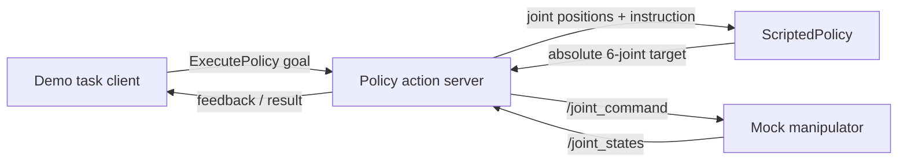

# PolicyBridge-ROS2

PolicyBridge-ROS2 is a lightweight ROS 2 runtime for exposing Python robot policies through a standard task-level action interface. The project is intended to grow toward consistent observation handling, action validation, cancellation, timeouts, diagnostics, and deterministic safe-stop behavior without coupling policy code to one simulator or robot stack.

> **M0 scope:** this repository currently targets only the deterministic six-joint mock demo described below. Timeout enforcement, diagnostics, and safe-stop behavior are future work and are not claimed as implemented.

## What problem it solves

Learned-policy prototypes often combine task requests, policy inference, robot I/O, and termination logic in one process. PolicyBridge-ROS2 introduces a small boundary between those concerns: a client submits a task through a ROS 2 action, a policy backend computes an absolute joint-position target, and a robot-facing node owns joint-state and joint-command topics. M0 demonstrates that boundary with no simulator, GPU, camera, or physical robot.

## M0 implementation scope

M0 is intentionally limited to one normal execution loop:

- `ExecutePolicy` is a ROS 2 action with goal, result, and feedback fields.
- `ScriptedPolicy` supports the exact instruction `move to home`.
- The policy action server consumes six-joint state feedback, validates six-element finite actions, publishes absolute joint-position targets, reports progress, and terminates on success or `max_steps` exhaustion.
- A cancellation request stops the server from publishing new commands and returns a canceled action result. It does **not** issue a hold-position or other safe-stop command.
- The mock manipulator moves six simulated joints toward each valid command at a bounded rate.
- The demo client submits one goal, prints feedback and the final result, and exits.
- Pure policy, action-validation, and mock-dynamics logic can be tested without ROS 2.

Unknown instructions and malformed actions are reported as explicit failures; they do not trigger random fallback behavior.

## Architecture



The policy backend and numerical validation/dynamics helpers are kept separate from ROS node classes so their behavior can be exercised by ordinary unit tests. See [docs/architecture.md](docs/architecture.md) for the component contracts and M0 execution flow.

## Requirements

The supported target environment is:

- Ubuntu 22.04
- ROS 2 Humble
- Python 3.10 or newer
- `colcon` with the ROS 2 `ament_cmake` and `ament_python` build types
- NumPy and pytest (normally resolved through `rosdep` / Ubuntu packages)

The demo does not require LangMani, LatentGuard, ManiSkill, Gazebo, Isaac Sim, MoveIt, a GPU, cameras, TF, point clouds, or external robot hardware.

## Build

Create a ROS 2 workspace and clone the repository under its `src` directory:

```bash
mkdir -p ~/policybridge_ws/src
cd ~/policybridge_ws/src
git clone <repository-url> PolicyBridge-ROS2
cd ~/policybridge_ws

source /opt/ros/humble/setup.bash
rosdep install --from-paths src --ignore-src -r -y
colcon build --symlink-install
source install/setup.bash
```

Replace `<repository-url>` with the actual repository URL. Source `/opt/ros/humble/setup.bash` in each new shell before building, and source the workspace's `install/setup.bash` before using its packages.

## Run the M0 demo

After building and sourcing the workspace:

```bash
ros2 launch policy_bridge demo.launch.py
```

The launch file starts the mock manipulator, policy action server, and demo client. To send the supported instruction from a separate sourced shell instead, run:

```bash
ros2 run policy_bridge demo_client --ros-args \
  -p instruction:="move to home"
```

## Expected output

The following is **illustrative**, not a recorded test result. Exact ROS timestamps, logger prefixes, progress samples, and episode IDs vary:

```text
[mock_manipulator] publishing six-joint state feedback
[policy_server] ExecutePolicy action server ready
[demo_client] goal accepted: move to home
[demo_client] feedback: step=<n> progress=<0.0..1.0>
[demo_client] result: success=True termination_reason=goal_reached episode_id=<episode-id>
```

A successful run ends with `success=True` and `termination_reason=goal_reached`. An unknown instruction should produce an explicit unsuccessful result rather than terminate the action-server process.

## Tests

Run the ROS-independent unit tests from the repository root:

```bash
python3 -m pytest policy_bridge/test
```

In a sourced ROS 2 Humble workspace, package tests can also be run through `colcon`:

```bash
colcon test --packages-select policy_bridge policy_bridge_interfaces
colcon test-result --verbose
```

These commands are instructions, not claims that ROS-dependent tests were executed on the machine viewing this README. If ROS 2 is unavailable, the pure Python tests remain the relevant local validation; launch and action integration must be verified later in a ROS 2 Humble environment.

The repository's current, environment-specific results are recorded in [docs/validation.md](docs/validation.md).

Initial M0 validation on 2026-07-15 ran `python -m pytest -q` in the available Windows development environment: **36 tests passed in 0.16 seconds**. ROS 2 Humble was not available there, so `colcon build`, ROS-dependent package tests, launch, topic, action-discovery, cancellation-integration, and end-to-end goal execution were **not executed**. The sample above must not be read as evidence of a successful ROS run.

## Current limitations

- Only one scripted instruction and one six-joint absolute-position action mode are supported.
- `timeout_seconds` is present in the action contract for compatibility with later milestones, but M0 does not enforce a wall-clock deadline.
- Cancellation stops new command publication only; it is not a deterministic safe stop.
- There is no fault injection, automatic recovery, lifecycle-node management, or formal real-time guarantee.
- There are no camera, RGB-D, TF, point-cloud, motion-planning, simulator, hardware, model-download, remote-inference, dashboard, database, rosbag, or deployment-platform integrations.
- The mock manipulator is a deterministic software test double, not a physics model.

## Possible M1 work (not implemented)

An M1 milestone could enforce `timeout_seconds` with a monotonic deadline, define a deterministic hold-position command for cancellation and failures, add structured diagnostics, and add ROS launch tests for timeout/cancellation/safe-stop paths. Those capabilities remain proposals; no M1 adapter, safety controller, or integration is included in M0.

## License

Licensed under the Apache License 2.0. See [LICENSE](LICENSE).
