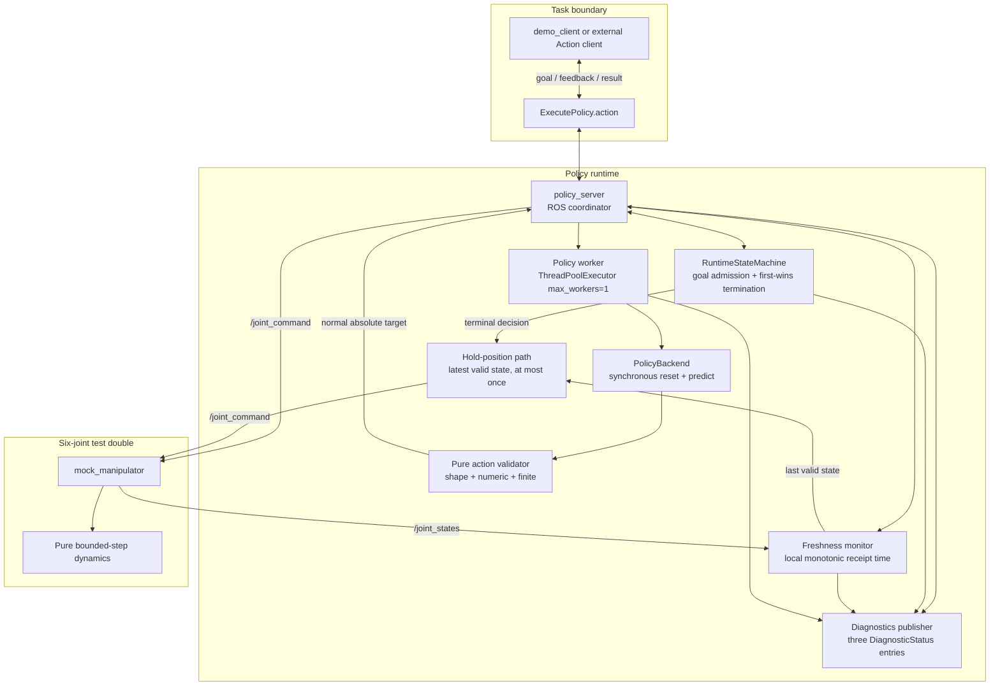
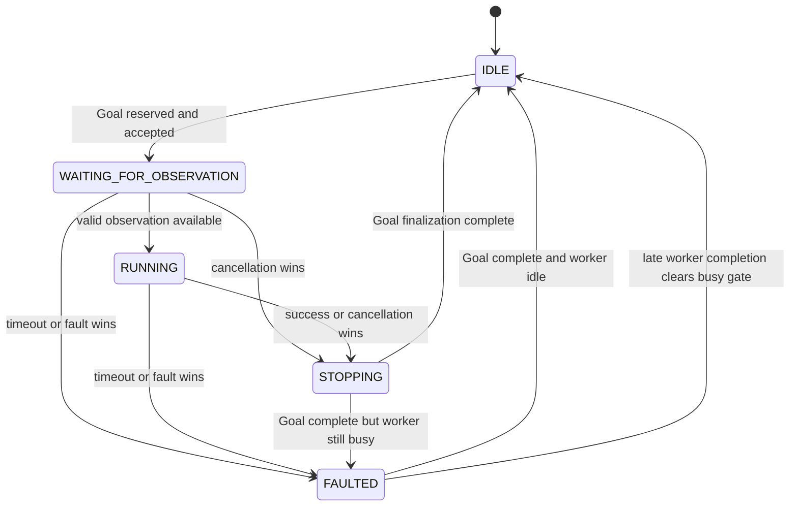
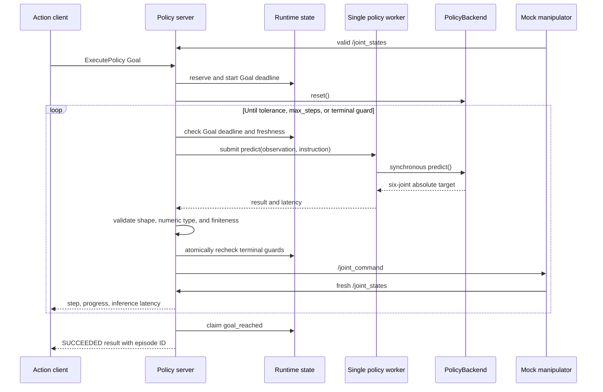

# M1 runtime architecture

PolicyBridge-ROS2 `0.2.0` adds fault handling around the original six-joint ROS 2 action loop without changing `policy_bridge_interfaces/action/ExecutePolicy.action`. The design keeps synchronous Python policy code behind a small boundary and makes Goal admission, terminal-state selection, command publication, hold-position, and diagnostics explicit.

The runtime is deterministic at the software boundary: one Goal owns the runtime, one policy call can be in flight, one terminal decision wins, and one winning decision can authorize at most one hold publication. This does not make the package a hard-real-time or safety-certified robot controller.

## Component view



### Responsibilities

| Component | Responsibility | Explicit boundary |
| --- | --- | --- |
| Demo/external client | Submit a Goal, receive feedback, request cancellation, consume one result | No scheduling, retry, recovery, or robot safety authority |
| Policy action server | Coordinate ROS callbacks, deadlines, worker calls, observations, command gating, finalization, and diagnostics | No hard real-time control or hardware emergency stop |
| `RuntimeStateMachine` | Atomically admit one Goal, track worker/observation state, and choose a first-wins terminal decision | Contains no ROS types or publisher side effects |
| Freshness monitor | Validate six-joint messages and track local monotonic age of the last valid receipt | Does not trust remote/header time as the local runtime deadline |
| Policy worker | Run one synchronous `predict()` call while the executor thread remains responsive | Cannot forcibly terminate arbitrary Python already running |
| `PolicyBackend` | Define ROS-independent synchronous `reset()` and `predict()` | No plugin discovery, download, network registry, or model lifecycle |
| Action validator | Require numeric, finite action data with shape `(6,)` | No clipping, random repair, or fallback target |
| Hold-position path | Copy and revalidate the latest valid state and publish it once as an absolute target | No braking profile, acknowledgment, torque/velocity control, or safety certification |
| Diagnostics publisher | Emit consistent runtime, observation, and policy snapshots | No dashboard, database, or remote telemetry transport |
| Mock manipulator | Apply bounded six-joint motion toward the latest absolute target and publish state | Not physics, collision checking, or hardware dynamics |

## ROS contracts

### Action

`policy_bridge_interfaces/action/ExecutePolicy.action` remains:

```text
# Goal
string instruction
int32 max_steps
float32 timeout_seconds

# Result
bool success
string termination_reason
string episode_id

# Feedback
int32 current_step
float32 progress
float32 inference_latency_ms
```

`max_steps` bounds policy-loop iterations. A positive `timeout_seconds` creates a whole-Goal monotonic deadline; zero disables only that deadline, and a negative/non-finite value is rejected. The server also rejects `max_steps <= 0`, a Goal concurrent with an active Goal, and a Goal submitted while a timed-out or canceled backend call is still running.

An accepted Goal receives an episode ID derived from its ROS Goal UUID. Admission rejection occurs before execution and therefore has no `ExecutePolicy.Result` termination reason.

### Topics

| Topic | Type | Publisher | Subscriber | Semantics |
| --- | --- | --- | --- | --- |
| `/joint_states` | `sensor_msgs/msg/JointState` | Mock/robot-side node | Policy server | Current positions for six configured joints |
| `/joint_command` | `std_msgs/msg/Float64MultiArray` | Policy server | Mock/robot-side node | Normal policy target or hold target, always six finite absolute positions |
| `/policy_bridge/diagnostics` | `diagnostic_msgs/msg/DiagnosticArray` | Policy server | Operators/test tools | Runtime, observation, and policy status snapshots |

Normal and hold commands intentionally share `/joint_command` and the same absolute-position interpretation. Command gating serializes freshness faults, cancellation, terminal claims, normal publication, and hold publication so a losing path cannot publish after termination.

## Runtime state and concurrency



The state machine uses one re-entrant lock for coherent Goal, worker, observation, hold, and diagnostic data. Separate server locks protect the latest joint vector, command side effects, result finalization, and diagnostic-event metadata.

The linearization rules are:

1. Goal admission atomically reserves the sole active-Goal slot.
2. `claim_termination()` accepts only the first live decision for the matching episode.
3. The command gate rechecks cancellation, Goal deadline, and observation freshness before every normal publication.
4. Finalization maps the immutable winning decision to exactly one Action state and result.
5. A hold-authorized decision must claim its one publication attempt before any hold side effect.

Thus near-simultaneous success/cancel, timeout/worker completion, and stale-observation/max-step races produce one coherent terminal result. A losing path reuses the existing decision and cannot issue a second result or hold.

## Normal execution sequence



Progress is derived from maximum absolute joint error and is feedback, not a second control signal. The success path still checks deadline, cancellation, and freshness before claiming `goal_reached`.

## Goal deadline

The Goal deadline starts when the accepted ROS Goal is bound to its UUID-derived episode. It uses `time.monotonic()`, so wall-clock corrections and ROS-time changes cannot move it backward.

Deadline checks occur while waiting for the first valid observation, before policy calls, during short-cycle worker polling, before command publication, during control-period waits, and before success. A whole-Goal timeout returns `ABORTED / goal_timeout`, requests hold, records elapsed time in diagnostics, and leaves the server available unless a policy call is still running.

When both Goal and inference deadlines exist, worker polling wakes for the earliest one. The same loop also checks cancellation, shutdown, and observation age; it does not block once for the full inference timeout.

## Policy worker and backend-busy lifecycle

The public backend protocol stays synchronous. The server owns one `ThreadPoolExecutor(max_workers=1)` and assigns each call a generation token. Completion clears `backend_busy` only when the token matches the active call, so a stale callback cannot release a newer call.

If inference exceeds `inference_timeout_seconds`, or if another terminal event wins while inference is running:

1. the Goal stops accepting policy output;
2. the appropriate terminal decision is finalized, including hold when authorized;
3. the worker remains `backend_busy` until the synchronous call actually finishes;
4. new Goals are rejected during that interval;
5. the eventual value or exception updates bounded diagnostic metadata but cannot publish an action or alter the prior result.

Python threads cannot safely kill arbitrary already-running Python or extension code. Executor shutdown cancels work that has not started but cannot guarantee immediate process exit if a custom backend never returns. All built-in test backends are deterministic and eventually complete: `delayed` waits a finite configured duration, invalid-action backends return immediately, and `raising` raises immediately. Process isolation or a killable model worker belongs outside M1.

## Observation freshness

The joint-state callback records local `time.monotonic()` receipt time only after validation. A state is valid when it has exactly six finite numeric positions. If names are present, the list must have matching lengths, no duplicates, and all configured names; positions are reordered into configured order. An empty name list means the six positions are already in configured order.

Two failures are distinct:

- `observation_timeout`: the Goal cannot obtain any valid state before `joint_state_timeout_seconds`.
- `stale_observation`: a previously valid state becomes older than `joint_state_timeout_seconds` during the Goal.

Invalid messages set the current validity flag false but do not refresh the last-valid timestamp. Near 80% of the freshness threshold, observation diagnostics become `WARN`; exceeding it during an active Goal produces an `ERROR` fault. Both failure paths request hold, but the no-state case records `safe_stop_unavailable_no_valid_state` rather than fabricating a zero vector.

## Action validation

The pure validator normalizes policy output to a `float64` NumPy vector only when it is numeric, finite, and exactly shape `(6,)`. Wrong shape, non-numeric data, NaN, or infinity produces `ABORTED / invalid_action`. Validation never clips, pads, replaces, or randomly repairs policy output.

`UnsupportedInstructionError` maps to `unsupported_instruction`; other backend reset/predict exceptions map to `policy_error`. The Action result contains the stable reason only. The exception type is sanitized into diagnostics, while detailed traceback data remains in ROS error logging rather than the result contract.

## Centralized termination and hold

The central termination decision contains the episode ID, Action status, reason, whether hold is authorized, and monotonic elapsed time. Finalization derives `success` from the status, publishes diagnostics, applies the corresponding ROS Action state, and stores one reusable result.

| Reason | Status | Hold authorization |
| --- | --- | --- |
| `goal_reached` | `SUCCEEDED` | No |
| `max_steps_exceeded` | `ABORTED` | Only after motion started |
| `unsupported_instruction` | `ABORTED` | Only after motion started |
| `goal_canceled` | `CANCELED` | Yes |
| `goal_timeout` | `ABORTED` | Yes |
| `policy_inference_timeout` | `ABORTED` | Yes |
| `observation_timeout` | `ABORTED` | Yes; may be unavailable without valid state |
| `stale_observation` | `ABORTED` | Yes |
| `invalid_action` | `ABORTED` | Yes |
| `policy_error` | `ABORTED` | Yes |

For an authorized hold, the command gate is acquired, the latest valid vector is copied and revalidated, and one `Float64MultiArray` is published. `safe_stop_count` increments only for a successful publication. Missing state and publication errors are retained as diagnostic outcomes. No normal policy command can pass the same gate after the winning terminal decision.

The term “hold” means only “publish the most recent valid six-joint state as a new absolute-position target.” It provides no controller acknowledgment, braking trajectory, velocity/torque behavior, redundant channel, hardware interlock, or emergency-stop certification.

## Diagnostics contract

The diagnostics timer publishes at `diagnostics_rate_hz`; important Goal, observation, worker, and terminal events trigger immediate additional snapshots. Every `DiagnosticArray` contains:

| Name | Keys | Levels and messages |
| --- | --- | --- |
| `policy_bridge/runtime` | `runtime_state`, `active_goal`, `episode_id`, `last_termination_reason`, `goal_elapsed_ms`, `safe_stop_count`, `safe_stop_status`, `last_safe_stop_reason` | Event level: normal admission/success `OK`, cancellation `WARN`, abort/fault `ERROR` |
| `policy_bridge/observation` | `joint_state_received`, `joint_state_valid`, `joint_state_age_ms`, `joint_state_timeout_ms` | `OK/observation_ok`; `WARN/waiting_for_observation` or `observation_near_timeout`; `ERROR/observation_timeout` or `stale_observation` |
| `policy_bridge/policy` | `backend_name`, `backend_busy`, `last_inference_latency_ms`, `inference_timeout_ms`, `last_policy_error` | `OK/policy_ok`; `WARN/backend_busy`; `ERROR/policy_inference_timeout`, `invalid_action`, or `policy_error` |

Values are captured from one immutable runtime snapshot. `last_policy_error` records a sanitized exception/validation category, and unknown latency/age is rendered as `unknown`. `safe_stop_status` is software bookkeeping (`not_requested`, `published`, or a failure/unavailable reason), not a certification claim.

## Configuration boundary

`policy_bridge/config/demo.yaml` supplies explicit defaults for the production `scripted` backend, per-inference timeout, observation timeout, diagnostic rate, control rate, joint names, and mock dynamics. Node startup validates numeric ranges and joint-name shape.

The backend factory is an explicit built-in allow-list:

- `scripted` is the production default;
- `delayed` is a finite-delay inference-timeout test double;
- `invalid_wrong_shape`, `invalid_nan`, and `invalid_inf` test action validation;
- `raising` tests policy exception handling.

There is no entry-point discovery, dynamic import, package installation, network model registry, or generic plugin lifecycle.

## Packaging and test boundary

The repository contains two ROS 2 packages:

- `policy_bridge_interfaces` uses `ament_cmake` and `rosidl_default_generators` to build the unchanged Action interface.
- `policy_bridge` uses `ament_python` and installs `policy_server`, `mock_manipulator`, `demo_client`, launch files, and YAML configuration. It depends on `diagnostic_msgs` for the M1 diagnostic topic.

Pure tests cover backend and state-machine rules without ROS. Humble launch tests use controlled publishers and clients to exercise timeout, freshness, invalid-action, exception, cancellation, hold, late-result, diagnostic, and race behavior. Exact environment-specific commands and results belong in [validation.md](validation.md), not in this architecture contract.

## Deliberately deferred scope

M1 does not implement LangMani/LatentGuard adapters, learned or neural-network models, dynamic plugins, model downloads, lifecycle nodes, camera/RGB-D pipelines, `message_filters`, TF, MoveIt/MoveIt Servo, Gazebo, Isaac Sim, ManiSkill, Unity, rosbag2, remote inference, gRPC, ONNX/TensorRT, dashboards, databases, remote telemetry, multi-robot orchestration, automatic recovery/replanning, hardware integration, controller safety certification, or an industrial emergency-stop interface.

Those are M2-or-later concerns. The current interfaces should not be interpreted as partial implementation of them.
