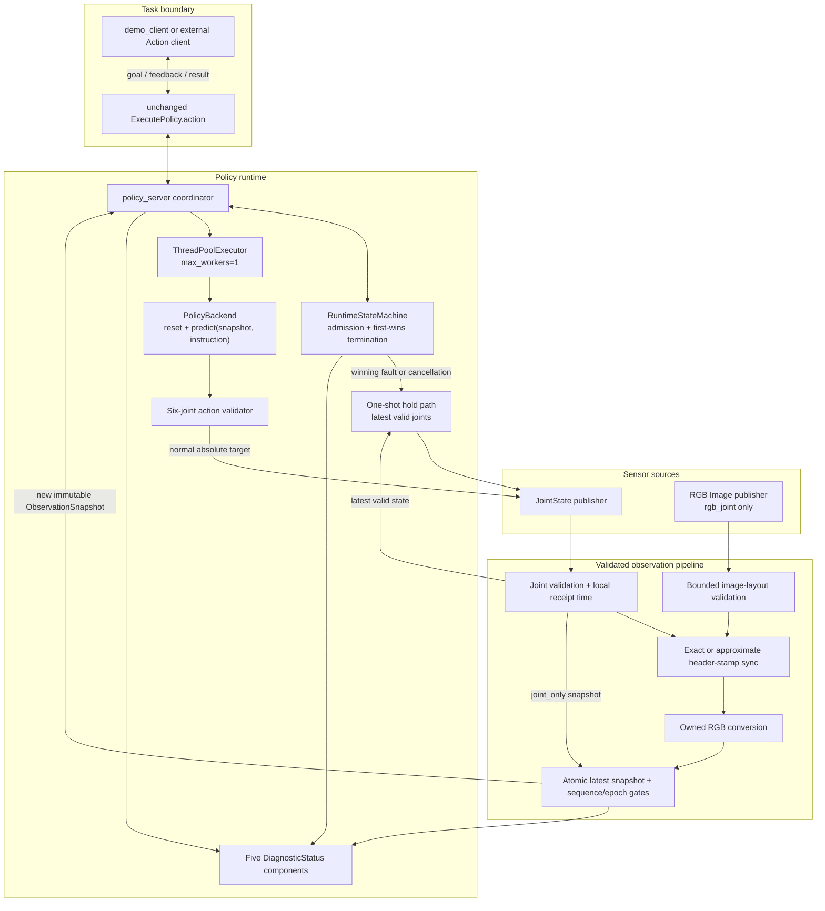
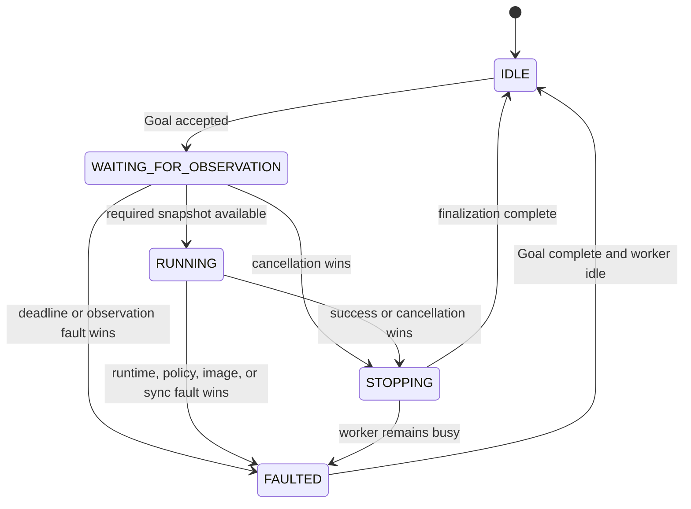
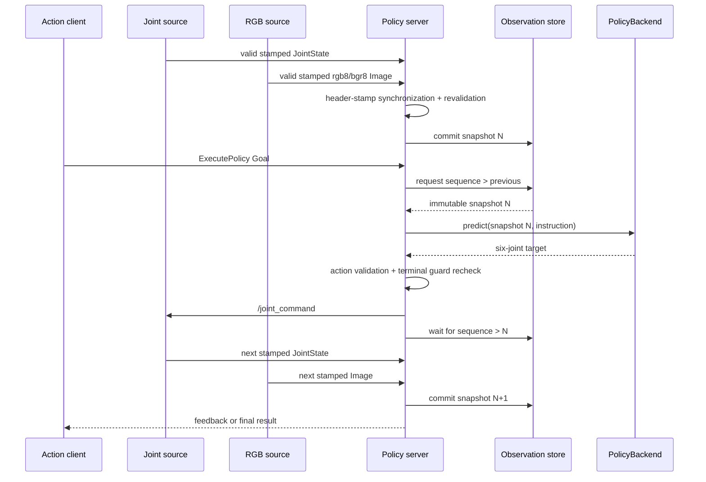

# M2 synchronized observation architecture

PolicyBridge-ROS2 `0.3.0` adds a synchronized RGB-plus-joint observation pipeline to the M1 runtime without changing `policy_bridge_interfaces/action/ExecutePolicy.action`. The runtime still has one active Goal, one synchronous policy call in flight, one first-wins terminal decision, and at most one hold publication authorized by that decision.

M2 changes the policy input boundary: every backend now receives one immutable `ObservationSnapshot`, never a ROS message or a bare joint array. The same boundary supports the default `joint_only` mode and the opt-in `rgb_joint` mode.

This architecture is deterministic at the message/runtime boundary. It is not hard real-time, a perception framework, a physical robot controller, or a safety-certified stopping system.

## Component view



### Responsibilities and boundaries

| Component | Responsibility | Explicit non-responsibility |
| --- | --- | --- |
| Policy server | Coordinate ROS callbacks, observation waits, deadlines, worker calls, publication gates, finalization, and diagnostics | No hard-real-time scheduling or hardware stop authority |
| Runtime state machine | Admit one Goal, track worker and joint freshness, and choose one terminal decision | No ROS messages or publisher side effects |
| Observation store | Assign sequence IDs, atomically commit snapshots, capture Goal/wait epochs, retain bounded health metadata, and classify image/sync waits | No image preprocessing or policy behavior |
| Joint validator | Reorder configured names, require six finite positions, and retain the latest valid vector for hold | Does not invent missing joints or a zero fallback |
| Image validator/converter | Reject unsafe layouts before allocation and produce an owned RGB array | No resize, crop, normalization, augmentation, or tensor/GPU conversion |
| Header synchronizer | Pair only validated stamped messages using a bounded queue | Does not pair “the latest” value from each topic |
| Policy worker | Run one synchronous backend call with bounded runtime polling around it | Cannot forcibly kill arbitrary Python already running in the thread |
| PolicyBackend | Consume only `ObservationSnapshot` plus instruction and return a six-joint target | No access to ROS message objects is required or allowed by the protocol |
| Hold path | Publish the latest valid joint state once as an absolute-position target when authorized | No braking profile, acknowledgment, or safety certification |

## ROS contracts

### Action

The public action remains exactly:

```text
# Goal
string instruction
int32 max_steps
float32 timeout_seconds

# Result
bool success
string termination_reason
string episode_id

# Feedback
int32 current_step
float32 progress
float32 inference_latency_ms
```

M2 does not add an image or mode field to the Goal. Observation mode is node configuration so an accepted Goal sees one coherent runtime contract. `max_steps`, whole-Goal timeout semantics, UUID-derived episode IDs, admission rejection, and M1 first-wins behavior remain unchanged.

### Topics and QoS

| Topic default | Type | Producer | Consumer | Contract |
| --- | --- | --- | --- | --- |
| `/joint_states` | `sensor_msgs/msg/JointState` | Robot or mock manipulator | Policy server | Exactly six finite configured positions |
| `/camera/rgb/image_raw` | `sensor_msgs/msg/Image` | Camera or mock RGB camera | Policy server in `rgb_joint` | Raw `rgb8` or `bgr8`, positive dimensions and valid layout |
| `/joint_command` | `std_msgs/msg/Float64MultiArray` | Policy server | Robot or mock manipulator | Six finite absolute positions; normal and hold use the same semantics |
| `/policy_bridge/diagnostics` | `diagnostic_msgs/msg/DiagnosticArray` | Policy server | Operators/tests | Five bounded metadata-only status entries |

The joint and image subscribers use an explicit sensor-data `QoSProfile`: `KEEP_LAST`, depth `sync_queue_size`, `BEST_EFFORT`, and `VOLATILE`. The mock publishers use ROS 2's explicit sensor-data profile, which has compatible reliability and durability. No transient-local image cache is used. Topic names are parameters and remain remappable.

## Observation mode selection

`observation_mode` is startup-validated and has two values:

- `joint_only` is the production default. Each valid JointState creates a snapshot with `rgb=None`; no image subscription, camera, or image deadline is required.
- `rgb_joint` requires a valid header-stamped joint message and valid header-stamped RGB image to form a policy snapshot. It never degrades to joint-only behavior.

`policy_backend=multimodal_scripted` is rejected unless the mode is `rgb_joint`. Other selector, numeric-range, queue, slop, topic, image-limit, and joint-name errors also fail during node initialization rather than appearing as a later Goal failure.

## ROS message to ObservationSnapshot boundary

The ROS-independent value is:

```python
@dataclass(frozen=True, slots=True)
class ObservationSnapshot:
    sequence_id: int
    joint_positions: NDArray[np.float64]
    joint_names: tuple[str, ...]
    rgb: NDArray[np.uint8] | None
    joint_stamp_ns: int
    image_stamp_ns: int | None
    received_monotonic_ns: int
    synchronization_skew_ms: float | None
    image_frame_id: str | None
```

The invariants are:

- `joint_positions` is an owned, read-only `float64` copy with shape `(6,)` and finite values.
- `joint_names` contains exactly six unique, non-empty names.
- `rgb`, when present, is an owned, read-only, C-contiguous `uint8` copy with shape `(H, W, 3)` in RGB channel order.
- `rgb=None` requires image stamp, skew, and frame ID to be `None`.
- RGB snapshots require positive joint/image header stamps, a non-empty frame ID, and a skew equal to the absolute header-stamp difference.
- Header stamps and `received_monotonic_ns` use integer nanoseconds; skew uses milliseconds.
- The dataclass is frozen and slotted, so fields cannot be replaced after construction.
- The observation store accepts only strictly newer positive `sequence_id` values.

The copies deliberately break aliasing with mutable ROS callback buffers and caller-owned NumPy arrays. Marking those copies read-only prevents a backend from changing the observation seen by another runtime path. Policy code receives neither `JointState` nor `Image`.

## Bounded image validation and conversion

The raw image callback performs allocation-bound checks before the message can enter synchronization:

1. require positive `height` and `width`;
2. require exactly `rgb8` or `bgr8`;
3. require `step >= width * 3`;
4. require enough source bytes for all `height` rows, including padding;
5. require `height * width <= max_image_pixels` and below the hard configuration ceiling;
6. require a positive header stamp and non-empty frame ID in RGB mode.

Only after a pair is synchronized does conversion allocate the final image. Per-row padding is removed, `bgr8` channels are reversed, and the output is copied into owned contiguous RGB storage. A malformed or oversized frame is discarded, records `last_image_error`, and never reaches either the synchronizer or the backend.

The default limit is 2,073,600 pixels (1920×1080); the configuration hard ceiling is 16,777,216 pixels (4096×4096). The runtime never performs model-specific preprocessing.

## Header timestamps versus monotonic freshness

The architecture intentionally uses two clock domains:

| Clock value | Used for | Not used for |
| --- | --- | --- |
| `JointState.header.stamp`, `Image.header.stamp` | Cross-topic matching and reported skew | Local “how long since receipt” deadlines |
| Local `time.monotonic()` / `time.monotonic_ns()` | Goal deadline, joint/image freshness, synchronized-snapshot waits, snapshot age | Deciding whether two device messages represent the same capture interval |

A missing or zero source stamp is not replaced with `now()`. `joint_only` can retain a zero joint header stamp because it does not perform cross-topic synchronization; `rgb_joint` requires positive stamps for both inputs.

This split keeps local timeout behavior stable across ROS-time jumps or device-clock offsets while preserving source-time semantics for synchronization.

## Synchronization pipeline

Raw callbacks first validate messages and update local receipt/freshness metadata. Valid stamped messages are then forwarded through `message_filters.SimpleFilter` objects into one bounded synchronizer:

- when `sync_slop_seconds > 0`, `ApproximateTimeSynchronizer` uses the two header stamps, finite `sync_queue_size`, configured slop, and `allow_headerless=False`;
- when `sync_slop_seconds == 0`, `TimeSynchronizer` provides exact header-stamp matching. This explicit path is necessary because Humble's approximate synchronizer uses a strict comparison and would not match a zero-slop pair.

After a candidate pair arrives, the callback independently revalidates both messages, converts the image, recomputes actual skew, constructs the immutable snapshot, and atomically replaces the latest snapshot only if its sequence is newer. It does not assume that selection by `message_filters` makes message content valid.

Validated filters are signaled only after the command gate is released. Humble synchronizers invoke registered callbacks under their own lock; avoiding `signalMessage()` while holding the command gate prevents an ATS-lock/command-gate inversion with cancellation or command publication.

## Goal-local and wait-local epochs

The observation store can capture an immutable, store-local `ObservationEpoch` containing the current snapshot sequence and bounded joint/valid-image/invalid-image arrival counters. It contains no ROS message or pixel payload. Two baselines prevent earlier traffic from being misclassified as a new fault:

- A **Goal epoch** is captured under the command gate before the Goal acceptance response. Only invalid images received after that baseline can classify the new Goal as `invalid_image`; an invalid frame left in historical diagnostics by a prior Goal cannot poison the next one.
- A **wait epoch** is captured whenever execution begins waiting for a snapshot newer than the sequence gate. `observation_sync_timeout` requires both a new valid stamped joint and a new valid image after this baseline, plus no newer synchronized snapshot through the configured wait. Previously received unmatched streams cannot cause an immediate sync timeout.

Epochs are tied to their originating store and validated before use. Together with `sequence_id`, they distinguish persistent health metadata from arrivals that are causally relevant to the current Goal or wait.

## Snapshot sequence gate

Each committed snapshot has a strictly increasing `sequence_id`. Execution tracks the ID used for the current inference:

```text
publish normal policy command
    ↓
wait until latest.sequence_id > previous.sequence_id
    ↓
run the next policy inference
```

Thus one joint-only update or one synchronized RGB/joint pair can drive at most one closed-loop inference. A timer tick cannot repeatedly reuse an old image or state. If the command consumed the final permitted step, the max-step terminal boundary is evaluated without demanding a snapshot for an inference that will never run.

The wait uses short wakeable polling/events and continues checking cancellation, whole-Goal deadline, ROS shutdown, joint freshness, image freshness, and synchronization timeout. A new snapshot and a competing terminal event pass through the same first-wins/command-gate checks before any command is published.

## Runtime state, command gate, and hold

The M1 runtime-state transitions remain:



One re-entrant state lock protects coherent Goal/worker/joint/hold metadata. The command gate is the linearization point for raw observation updates, conditional fault claims, cancellation, normal command publication, and hold publication. The rules are:

1. admission reserves the sole active-Goal slot;
2. `claim_termination()` accepts only the first live decision for the episode;
3. every normal publication rechecks cancellation, deadlines, and current observation health under the command gate;
4. a hold-authorized winner claims at most one hold attempt;
5. finalization maps that immutable decision to exactly one Action state and result;
6. late worker output and losing race paths cannot publish a normal command.

The latest valid raw joint vector is retained independently of RGB synchronization so an image or synchronization failure can hold the best locally received joint state. If no valid vector exists, the server reports `safe_stop_unavailable_no_valid_state` and does not fabricate a target.

## Image and synchronization fault classification

M2 keeps the M1 `observation_timeout`/`stale_observation` reasons for joint health and adds four distinct RGB-side results:

| Reason | Classification condition | Result/hold |
| --- | --- | --- |
| `image_timeout` | No image arrived and no valid image exists before `image_timeout_seconds` | `ABORTED`; hold requested |
| `invalid_image` | Images arrived but remained invalid through the wait limit, or a recent invalid stream replaced a prior valid one | `ABORTED`; hold requested; last validation error retained |
| `stale_image` | A previously valid image is older than `image_timeout_seconds` and no recent invalid-frame classification supersedes it | `ABORTED`; hold requested |
| `observation_sync_timeout` | Valid fresh joint and image inputs exist, but no snapshot newer than the required sequence appears within `synchronized_observation_timeout_seconds` | `ABORTED`; hold requested |

A single invalid frame is dropped rather than terminating immediately; a later valid synchronized frame may recover the wait. Sync timeout does not mask missing or stale images, and image faults do not collapse into the joint-only `observation_timeout` reason. Goal timeout, cancellation, and joint-stale races still produce only one terminal winner.

## Normal multimodal sequence



## Policy backend boundary

There is one signature across all built-in backends:

```python
class PolicyBackend(Protocol):
    def reset(self) -> None: ...

    def predict(
        self,
        observation: ObservationSnapshot,
        instruction: str,
    ) -> np.ndarray: ...
```

`scripted` reads `observation.joint_positions` and works in joint-only mode. `multimodal_scripted` additionally requires RGB, verifies shape/dtype/bounds, and reads deterministic pixel information before returning the fixed home target. It proves transport through the backend boundary; it does not perform visual planning. Delayed, invalid-action, and raising M1 backends use the same snapshot signature.

The factory remains a static built-in allow-list. There is no entry-point discovery, model download, network registry, remote API, or model lifecycle system.

## Diagnostics contract

The timer and important state changes publish one `DiagnosticArray` with five statuses:

| Name | Keys | Typical states |
| --- | --- | --- |
| `policy_bridge/runtime` | `runtime_state`, `active_goal`, `episode_id`, `last_termination_reason`, `goal_elapsed_ms`, `safe_stop_count`, `safe_stop_status`, `last_safe_stop_reason` | Admission/success `OK`; cancellation `WARN`; abort `ERROR` |
| `policy_bridge/observation` | `joint_state_received`, `joint_state_valid`, `joint_state_age_ms`, `joint_state_timeout_ms` | Waiting/near timeout `WARN`; joint timeout/stale `ERROR` |
| `policy_bridge/policy` | `backend_name`, `backend_busy`, `last_inference_latency_ms`, `inference_timeout_ms`, `last_policy_error` | Busy `WARN`; inference/action/backend fault `ERROR` |
| `policy_bridge/image` | `image_required`, `image_received`, `image_valid`, `image_age_ms`, `image_timeout_ms`, `encoding`, `width`, `height`, `frame_id`, `last_image_error` | Disabled/healthy `OK`; waiting/invalid/near timeout `WARN`; winning image fault `ERROR` |
| `policy_bridge/synchronization` | `synchronized_snapshot_available`, `snapshot_sequence_id`, `snapshot_age_ms`, `last_sync_skew_ms`, `sync_slop_ms`, `sync_queue_size`, `synchronized_observation_timeout_ms`, `last_sync_error` | Disabled/synchronized `OK`; waiting `WARN`; winning sync fault `ERROR` |

Internally, image and synchronization health keep separate current and historical error strings. A valid image clears the current image error, and a valid synchronized pair clears the current sync error; diagnostic level/message decisions use current health. The public `last_image_error` and `last_sync_error` fields retain the most recent historical cause for inspection, so recovery can return a component to `OK` without erasing useful history. `last_termination_reason` behaves similarly at the runtime level. Diagnostics never include image bytes or NumPy arrays.

## Packaging and demos

The repository remains two ROS packages:

- `policy_bridge_interfaces` builds the unchanged action with `ament_cmake` and rosidl generators.
- `policy_bridge` uses `ament_python` and installs `policy_server`, `mock_manipulator`, `mock_rgb_camera`, `demo_client`, both launch files, and both YAML files. It declares `message_filters`, `sensor_msgs`, `diagnostic_msgs`, and the existing runtime dependencies.

`demo.launch.py` plus `demo.yaml` remain the camera-free `joint_only` regression path. `multimodal_demo.launch.py` plus `multimodal_demo.yaml` start the mock manipulator, deterministic RGB camera, `rgb_joint` server with `multimodal_scripted`, and the same one-shot client.

Pure tests cover snapshot invariants, defensive copies, image layouts/conversion, parameter bounds, backends, sequence storage, and fault classification without ROS. Humble launch tests are responsible for proving topic delivery, actual synchronization, backend RGB receipt, Goal outcomes, hold behavior, cancellation, races, diagnostics, and recovery. Environment-specific evidence is recorded in [validation.md](validation.md).

## Deliberately unsupported scope

M2 is not a complete perception or robotics stack. It does not implement depth, compressed images, more than one camera, camera calibration or `CameraInfo`, TF, `PointCloud2`, OpenCV/model preprocessing, GPU tensors, CUDA, neural-network loading, VLM/VLA models, LangMani, LatentGuard, OpenAI/Hugging Face/remote APIs, dynamic plugin discovery, lifecycle nodes, rosbag2, MoveIt, ros2_control, Gazebo, Isaac Sim, ManiSkill, Unity, real robot drivers, remote inference, gRPC, ONNX, TensorRT, dashboards, databases, multi-robot coordination, automatic recovery/replanning, hard-real-time guarantees, or controller safety certification.

LangMani or LatentGuard could be integrated later by implementing the existing `PolicyBackend` contract, but neither is implemented or represented as currently supported.
