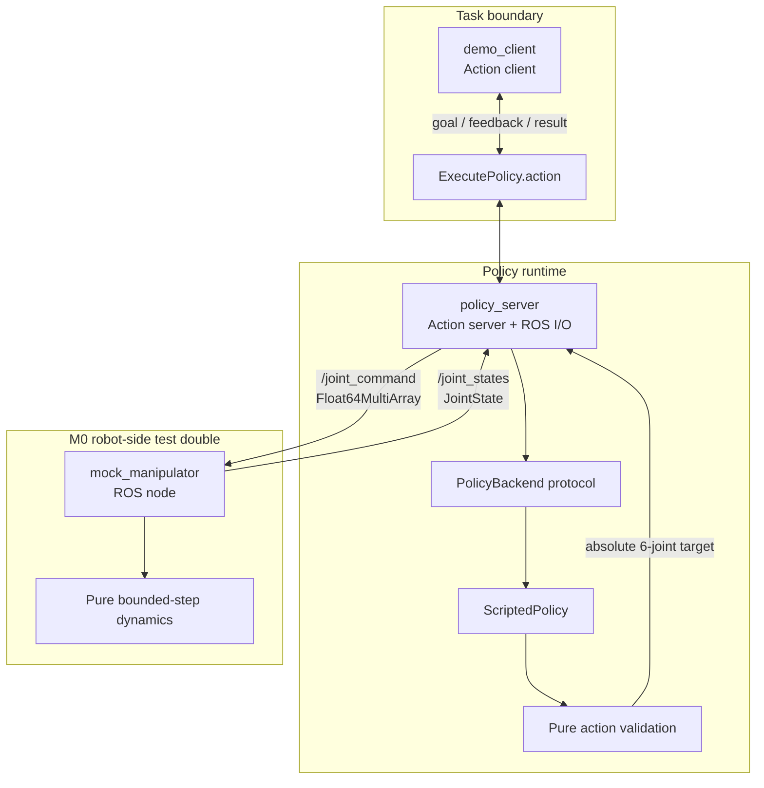
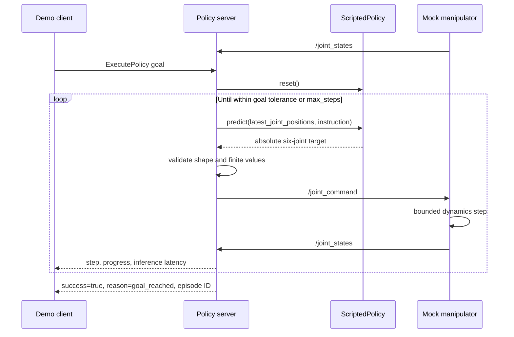

# M0 architecture

PolicyBridge-ROS2 M0 proves one small boundary: a task-level ROS 2 action can drive a deterministic Python policy against a stand-alone six-joint test double. It is not a general robot-control framework and does not include the timeout, diagnostics, or safe-stop capabilities proposed for later milestones.

## Component view



### Responsibilities

| Component | M0 responsibility | Explicit non-responsibility |
| --- | --- | --- |
| Demo client | Wait for the server, send one goal, print feedback/result, exit | Scheduling, retries, recovery |
| Policy action server | Coordinate the goal loop, read the latest joint state, validate/publish actions, report progress, finish/abort/cancel | Hard real-time control, timeout enforcement, deterministic safe stop |
| `PolicyBackend` | Define the ROS-independent `reset` and `predict` boundary | Plugin discovery or model lifecycle |
| `ScriptedPolicy` | Map `move to home` and six joint positions to one deterministic absolute target | Learned inference, random fallback, multiple action modes |
| Mock manipulator | Validate commands, apply bounded joint updates, publish state | Physics, collision checking, actuator dynamics |
| Pure helpers | Validate arrays and compute one bounded dynamics step | ROS communication or mutable global state |

## ROS contracts

### Action

`policy_bridge_interfaces/action/ExecutePolicy.action` defines:

```text
# Goal
string instruction
int32 max_steps
float32 timeout_seconds

# Result
bool success
string termination_reason
string episode_id

# Feedback
int32 current_step
float32 progress
float32 inference_latency_ms
```

In M0, `max_steps` bounds policy-loop iterations. `timeout_seconds` is carried in the public contract but is not enforced; a later milestone must define its clock and termination semantics before enabling it.

### Topics

| Topic | Type | Publisher | Subscriber | M0 semantics |
| --- | --- | --- | --- | --- |
| `/joint_states` | `sensor_msgs/msg/JointState` | Mock manipulator | Policy server | Current positions for six configured joints |
| `/joint_command` | `std_msgs/msg/Float64MultiArray` | Policy server | Mock manipulator | Absolute position target with exactly six finite values |

M0 has one action interpretation only: an absolute joint-position target. Values are not treated as velocities or deltas.

## Successful execution sequence



The server waits for valid joint feedback before executing policy steps. Progress is derived from distance to the target and is feedback, not a second control signal. The mock moves toward the target without exceeding its per-step delta and holds steady once it is within tolerance.

## Failure and cancellation boundaries

- An unsupported instruction produces an explicit unsuccessful action result; there is no random or silent fallback.
- Policy output must have shape `(6,)`, be numeric, and contain only finite values before publication.
- A mock-manipulator command must also contain exactly six finite values.
- Reaching `max_steps` without reaching the goal returns an unsuccessful result.
- On an accepted cancellation request, the policy server stops publishing new commands and marks the goal canceled.

Cancellation in M0 is a control-plane behavior only. The mock manipulator retains the most recently received target, so stopping publication alone must not be represented as a physical safe stop. A future safe-stop contract should explicitly define the command sent, acknowledgment, and failure behavior.

## Configuration boundary

The launch configuration exposes the mock-manipulator rates, per-step motion limit, joint names, initial positions, and goal tolerance as ROS parameters. Policy-loop settings and the demo goal are likewise supplied through ROS parameters rather than absolute paths or global mutable state. Launch and YAML files are installed into the package share directory by `setup.py`.

## Packaging

The repository contains two ROS 2 packages:

- `policy_bridge_interfaces` uses `ament_cmake` and `rosidl_default_generators` to build the action interface.
- `policy_bridge` uses `ament_python` and installs the `policy_server`, `mock_manipulator`, and `demo_client` console scripts together with `launch/*.launch.py` and `config/*.yaml`.

Keeping the interface in its own package prevents Python runtime packaging from becoming part of the ROS interface-generation dependency cycle.

## Deferred work

Possible M1 work includes monotonic timeout enforcement, an explicit deterministic hold-position behavior, structured diagnostics, fault-path integration tests, and clear stop acknowledgments. No LangMani/LatentGuard adapter, simulator integration, motion planner, camera pipeline, model runtime, remote inference, multi-robot layer, dashboard, or deployment platform is part of M0.
